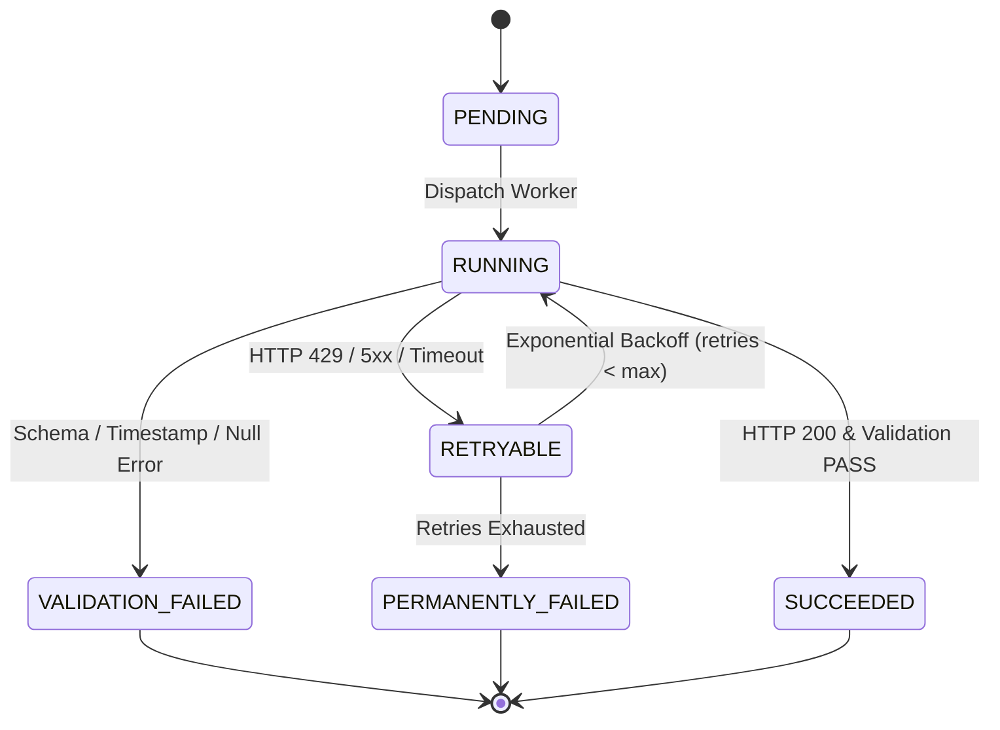

# Phase 3.8 — Historical Meteorological Extraction Design

## 1. Purpose and Scope

### 1.1 Objective
Design a robust, reproducible, and verifiable historical meteorological extraction pipeline for Open-Meteo ECMWF ERA5 reanalysis data covering the State of Karnataka across the validated historical flood period (1969–1994). This pipeline establishes the environmental predictor baseline required for future flood-ML feature engineering.

### 1.2 Scope Boundaries
- **Historical ERA5 Extraction Only:** Targets the multi-decade reanalysis archive (`/v1/archive`), completely decoupled from operational short-term forecast ingestion.
- **Intended Period:** 1969-01-01 through 1994-12-31 (26 full calendar years, 9,496 calendar days), encompassing all audited IFI historical flood events in Karnataka (1969-07-14 through 1994-10-05) plus necessary antecedent meteorological buffers.
- **Intended Spatial Coverage:** The validated 0.25° ERA5 grid covering the State of Karnataka (324 intersecting cells; 253 interior center cells).
- **Core Variables:** Precipitation, surface temperature at 2m, relative humidity at 2m, and surface pressure.
- **Strict Separation from Operational Ingestion:**
  - Operational Open-Meteo ingestion (`mode='operational'`, `api.open-meteo.com/v1/forecast`) writes to existing `weather_observations` and `rainfall_observations` with `data_category = 'MODEL_OUTPUT'` or `'FORECAST'`.
  - Historical reanalysis data must **never** overwrite, collide with, or silently mix into operational monitoring tables. Historical records must be designated with `data_category = 'REANALYSIS'`, tracked under a dedicated historical data source ID, and stored in a layered staging architecture (Raw JSON $\to$ Clean Parquet/Staging $\to$ Aggregated Features).

---

## 2. Dataset Contract

| Parameter / Attribute | Specification | Verification Basis |
| :--- | :--- | :--- |
| **API Endpoint** | `https://archive-api.open-meteo.com/v1/archive` | Empirically verified in Phase 3.7B Gate 1 |
| **Model Identifier** | `models=era5` (Explicitly requested) | Snaps to 0.25° grid; non-null precipitation |
| **Timezone** | `timezone=UTC` (Mandatory) | Prevents calendar-boundary shifting; zero offset |
| **Precipitation Unit** | `precipitation_unit=mm` | Millimeters ($mm$, equivalent to $kg/m^2$) |
| **Temperature Unit** | `temperature_unit=celsius` | Degrees Celsius ($^\circ\text{C}$) |
| **Hourly Variables** | `precipitation`, `temperature_2m`, `relative_humidity_2m`, `surface_pressure` | Full 4-variable suite validated in Gate 1 & 4 |
| **Precipitation Semantics** | Interval-based accumulation of preceding hour | Non-negative ($\ge 0.0\text{ mm}$); daily sum valid |
| **Thermal / Pressure Semantics** | Instantaneous hourly state estimates | T ($^\circ\text{C}$), RH ($0\text{--}100\%$), SP ($hPa$) |
| **Grid Snapping** | Input coordinates snap to nearest $0.25^\circ$ cell center | Snapping must be logged and audited |

---

## 3. Spatial Extraction Strategy

### 3.1 Validated Grid Definition
- **Grid Spacing:** Regular $0.25^\circ$ latitude $\times 0.25^\circ$ longitude (~27.8 km N-S, ~26.8 km E-W).
- **Bounding Box Range:** Latitude $[11.50^\circ\text{N}, 18.50^\circ\text{N}]$, Longitude $[74.00^\circ\text{E}, 78.50^\circ\text{E}]$.
- **Total Candidate Cells in Bounding Grid:** 682 cells.

### 3.2 Cell Selection Hierarchy
1. **Intersecting Cells (324 Cells):** Cells whose $0.25^\circ \times 0.25^\circ$ bounding polygon intersects the authoritative KSR-SAC Karnataka state polygon (`ST_Intersects`). Every district possesses between 8 and 37 intersecting cells.
2. **Interior Center Cells (253 Cells):** Cells whose geometric center point $(lat_c, lon_c)$ falls strictly inside the state boundary (`ST_Contains`). Every district possesses between 3 and 17 interior centers.
3. **Boundary / Intersecting Cells (71 Cells):** Cells that overlap Karnataka territory but whose center lies in a neighboring state or maritime margin.

### 3.3 Boundary and Coastal Treatment
- **324 Intersecting Cells Preserved in Authoritative Definition:** All 324 intersecting cells are retained in the authoritative state grid definition to ensure complete spatial coverage of the state territory without artificial truncation.
- **No Coordinate Invention:** Extraction must query exact $0.25^\circ$ grid centers. Offshore or out-of-state points must not be artificially moved or clipped.
- **Auditable Coordinate Logging:** Both the requested coordinate and the returned coordinate must be preserved in raw metadata to verify that no unintended snapping occurred.
- **District Aggregation Weighting Deferred:** District aggregation weighting (e.g. area-weighting vs unweighted averaging of boundary cells) is NOT decided in this extraction phase; it is explicitly deferred to the later feature-engineering phase.

### 3.4 Authoritative Grid vs. Extraction-Eligible Grid (Phase 3.12C)

#### 1. Architecture Overview
- **Authoritative Karnataka Grid (324 Cells):** The complete set of $0.25^\circ \times 0.25^\circ$ cells intersecting the KSR-SAC Karnataka state polygon. This definition remains permanent, immutable, and canonical across the FloodPulse platform.
- **ERA5 Extraction-Eligible Grid (318 Cells):** The subset of authoritative cells that can be extracted from Open-Meteo ERA5 without spatial distortion or land-sea snapping.
- **Excluded Source-Incompatible Cells (6 Cells):** Exactly 6 boundary cells along the western maritime margin that cannot be extracted with 1:1 spatial identity.

#### 2. Source-Specific Excluded Cells
The following 6 cells are explicitly excluded from Open-Meteo ERA5 extraction:
1. `ERA5_1275_07475` (Latitude: $12.75^\circ\text{N}$, Longitude: $74.75^\circ\text{E}$)
2. `ERA5_1375_07450` (Latitude: $13.75^\circ\text{N}$, Longitude: $74.50^\circ\text{E}$)
3. `ERA5_1400_07450` (Latitude: $14.00^\circ\text{N}$, Longitude: $74.50^\circ\text{E}$)
4. `ERA5_1450_07425` (Latitude: $14.50^\circ\text{N}$, Longitude: $74.25^\circ\text{E}$)
5. `ERA5_1475_07400` (Latitude: $14.75^\circ\text{N}$, Longitude: $74.00^\circ\text{E}$)
6. `ERA5_1500_07400` (Latitude: $15.00^\circ\text{N}$, Longitude: $74.00^\circ\text{E}$)

#### 3. Reason for Exclusion
> "Open-Meteo ERA5 archive snaps requested offshore coordinate to a neighboring land-side ERA5 coordinate, preventing one-to-one spatial identity."

When queried, Open-Meteo's ERA5 endpoint does not return data centered at these 6 offshore cell centers. Instead, its land-sea mask snaps each requested coordinate to an adjacent land-side grid point already represented by another cell in the grid.

#### 4. Distinction Between Geographic Coverage and Source Coverage
- **Geographic Coverage (Territorial Reality):** Refers to the physical administrative extent of Karnataka. All 324 cells (including the 6 offshore boundary cells) intersect the state border polygon and remain part of the authoritative Karnataka spatial definition. They are never deleted from the platform geometry.
- **Source Coverage (Provider-Specific Feasibility):** Refers to the actual capability of a specific data provider (Open-Meteo ECMWF ERA5) to return distinct, non-snapped, physically accurate data for each grid point.
- **Strict Architectural Invariants Upheld:**
  - **No Coordinate Tolerance:** FloodPulse strictly rejects introducing a 0.25° coordinate mismatch tolerance in the raw validator.
  - **No Coordinate Rewriting:** FloodPulse refuses to rewrite requested coordinates to match returned coordinates.
  - **No Result Deduplication:** FloodPulse refuses to deduplicate snapped API results.
  - **Explicit Eligibility Filtering:** Instead of silent mutation or deletion, extraction eligibility is managed via an explicit filter (`eligible_only=True` in `get_spatial_batches` and `get_era5_eligible_grid()`), ensuring complete auditability and provenance.

#### 5. Phase 3.12D Backward-Compatible Inventory Architecture
- **Authoritative Partitioning:** 33 permanent spatial batches (32 batches of 10 cells + 1 final batch of 4 cells across the 324 authoritative cells).
- **In-Batch Source Exclusion:** Rather than repackaging into 32 batches (which shifted coordinate windows starting at Batch 4), exclusions are applied *within* each permanent spatial batch:
  - 26 batches contain 10 eligible cells
  - 6 batches contain 9 eligible cells (Batches 004, 011, 012, 015, 016, 018)
  - 1 batch contains 4 eligible cells (Batch 033)
  - Total eligible cells queried: **318 cells**
- **Deterministic Spatial Fingerprint:** Each batch computes an 8-character hex SHA-256 fingerprint from its sorted cell IDs (e.g. `57ba28d6`, `816470cd`). Dual-key manifest verification confirms both payload file hash and spatial fingerprint.
- **Production Inventory Units:** $33\text{ batches} \times 26\text{ years} = \mathbf{858\text{ total chunks}}$.
- **Total Daily Processed Records:** 3,019,728 records (20 non-leap years $\times 318 \times 365 = 2,321,400$; 6 leap years $\times 318 \times 366 = 698,328$).
- **Zero Artifact Invalidation:** All 17 existing raw payloads and 13 daily Parquet files match their respective 33-batch coordinates bit-for-bit without any file movement or deletion.

---

## 4. Temporal Extraction Strategy

### 4.1 Temporal Span
- **Start Date:** `1969-01-01` (Provides a 6-month antecedent meteorological buffer before the earliest IFI flood event on `1969-07-14`).
- **End Date:** `1994-12-31` (Provides complete annual closure past the latest IFI event on `1994-10-04`).
- **Duration:** 26 full calendar years (9,496 calendar days).

### 4.2 Temporal Rules & Integrity
- **Hourly Records:** Each complete day contains exactly 24 hourly records ($00:00$ through $23:00$ UTC).
- **UTC Storage:** All raw timestamps and normalized records are strictly referenced to UTC.
- **Leap Year Handling:** Leap years (1972, 1976, 1980, 1984, 1988, 1992) contain exactly 366 days (8,784 hours), with all 24 hours of February 29 validated as continuous.
- **Incomplete Days & Missing Hours:** If any hour within a 24-hour day is missing or null, the day is flagged as `INCOMPLETE`. No interpolation or filling is permitted during raw extraction.
- **Duplicate Timestamps:** Any duplicate timestamp within a chunk causes a `VALIDATION_FAILED` status.

---

## 5. Variables

| Variable Name | API Identifier | Physical Meaning | Unit | Status | Rationale |
| :--- | :--- | :--- | :--- | :--- | :--- |
| **Precipitation** | `precipitation` | Hourly accumulation of preceding 1 hour | $mm$ | **REQUIRED** | Primary driver of surface runoff and flood hazard |
| **2m Temperature** | `temperature_2m` | Air temperature at 2 meters above ground | $^\circ\text{C}$ | **REQUIRED** | Required for evapotranspiration and antecedent moisture index |
| **Relative Humidity**| `relative_humidity_2m`| Relative humidity at 2 meters above ground | $\%$ | **REQUIRED** | Vapor pressure deficit and atmospheric saturation indicator |
| **Surface Pressure** | `surface_pressure` | Atmospheric pressure at land surface | $hPa$ | **REQUIRED** | Confirms topographic elevation scaling and synoptic low pressure |
| **Wind Speed (10m)** | `wind_speed_10m` | Wind speed at 10 meters | $km/h$ | *OPTIONAL* | Excluded from baseline extraction to minimize payload size |
| **Soil Moisture** | `soil_moisture_...` | Volumetric soil water content | $m^3/m^3$ | *EXCLUDED* | Belongs to ERA5-Land (not available in core atmospheric ERA5) |

---

## 6. Raw Data Preservation

Every API response must be saved to disk before any transformation or parsing occurs.

### 6.1 Raw File Hierarchy
```text
data/raw/era5_historical/
├── manifests/
│   └── extraction_manifest.json
├── raw_payloads/
│   └── year=1994/
│       ├── batch_001_1994.json.gz
│       ├── batch_002_1994.json.gz
│       └── ...
└── logs/
    └── extraction_audit.log
```

### 6.2 Raw Metadata Wrapper
Each saved raw payload must encapsulate:
```json
{
  "extraction_metadata": {
    "batch_id": "era5_1994_batch_001",
    "requested_url": "https://archive-api.open-meteo.com/v1/archive?...",
    "requested_model": "era5",
    "requested_lats": [14.25, 14.25, ...],
    "requested_lons": [76.50, 76.75, ...],
    "requested_start_date": "1994-01-01",
    "requested_end_date": "1994-12-31",
    "requested_timezone": "UTC",
    "retrieved_at_utc": "2026-09-20T01:50:00Z",
    "http_status": 200,
    "response_latency_seconds": 2.14,
    "payload_sha256": "e3b0c44298fc1c149afbf4c8996fb92427ae41e4649b934ca495991b7852b855"
  },
  "api_response": [ ... ]
}
```

---

## 7. Checkpoint and Resume Design

### 7.1 Deterministic Extraction Unit
- **Extraction Unit:** **1 Spatial Batch $\times$ 1 Calendar Year**
  - Spatial Batch: 10 grid cells (comma-separated query; final batch 033 has 4 cells).
  - Time Chunk: 1 calendar year (`start_date=YYYY-01-01&end_date=YYYY-12-31`).
  - Total Spatial Batches: **33 permanent batches** across the 324 authoritative Karnataka grid cells.
  - In-Batch Eligibility: 6 coastal snapping cells are excluded within their respective batches (Batches 004, 011, 012, 015, 016, 018 query 9 cells; all others query 10 cells; Batch 033 queries 4 cells).
  - Total Eligible Cells Queried: **318 cells**.
  - Total Extraction Units: $33\text{ batches} \times 26\text{ years} = \mathbf{858\text{ total chunks}}$.
  - **Dual-Key Spatial Verification (Manifest Schema v1.1):**
    Each chunk is verified using both payload checksum (`compressed_sha256`) and deterministic 8-character hex cell-set fingerprint (`spatial_fingerprint`). This prevents silent coordinate shifting or inventory drift across runs.
  - **100% Backward Compatibility:** All 17 raw payloads and 13 daily Parquet chunks produced in earlier phases remain 100% compatible and valid without file re-extraction or modification.

### 7.2 Chunk State Machine


- **`PENDING`:** Unit registered in manifest, awaiting execution.
- **`RUNNING`:** Active HTTP request dispatched; locked with process ID and timestamp.
- **`SUCCEEDED`:** HTTP 200 received, payload hash verified, schema and timestamp validation passed, compressed raw file written.
- **`RETRYABLE`:** Transient failure (HTTP 429, 502, 503, 504, timeout); eligible for backoff retry.
- **`PERMANENTLY_FAILED`:** Retry limit reached without success; requires operator investigation.
- **`VALIDATION_FAILED`:** Data corruption, unexpected nulls, coordinate mismatch, or timestamp discontinuity. Never silently retried.

### 7.3 Idempotency Guarantee
A chunk marked `SUCCEEDED` in `extraction_manifest.json` with an existing, non-empty `.json.gz` file matching the recorded SHA-256 hash is **never** re-downloaded.

---

## 8. Retry and Rate Limiting

### 8.1 Conservative Parameter Configuration
- **Connection Timeout:** 15.0 seconds.
- **Read Timeout:** 30.0 seconds.
- **Request Pacing:** Maximum **2 requests per second** (500 ms baseline delay between dispatches).
- **Concurrency:** Maximum **1 worker** in baseline operation (strictly sequential); up to 2 workers only during dry-run validation.
- **Maximum Retries:** 4 attempts per chunk.

### 8.2 Backoff Strategy
For transient failures:
$$T_{\text{wait}} = \min\left(60.0,\, 2.0^{\text{attempt}} \times 2.0\right) + \text{Uniform}(0.5, 2.0)$$
- **HTTP 429 (Rate Limit):** Immediate forced pause of 60.0 seconds before the next retry.
- **HTTP 5xx (Server Error):** Exponential backoff ($4\text{s}, 8\text{s}, 16\text{s}, 32\text{s}$).
### 8.3 Operational Feasibility & Runtime Caveats
While individual single-cell and 10-cell multi-point requests were empirically demonstrated in Phase 3.7B Gate 4 and the 1994 dry run, **the complete 26-year statewide extraction (858 chunks) must NOT be claimed as operationally guaranteed**. An approximate sequential runtime can be extrapolated from the 1994 dry-run latency, but this is not a production guarantee. Actual runtime may vary because of network conditions, provider throttling, retries, failures, and response-time variation across chunks.

---

## 9. Validation

Every retrieved chunk must pass ten automated integrity checks before being marked `SUCCEEDED`:

1. **HTTP Status:** Must equal `200`.
2. **Payload Completeness:** JSON array length must match the number of requested batch coordinates.
3. **Coordinate Snapping:** Returned `(latitude, longitude)` must match the expected $0.25^\circ$ cell centers within $\pm 0.001^\circ$.
4. **Timestamp Count:** Returned `time` array length must equal exactly $\text{days\_in\_year} \times 24$ (8,760 hours for non-leap years, 8,784 hours for leap years).
5. **Strict Temporal Progression:** $t_{i+1} - t_i = 1\text{ hour}$ for all $i$.
6. **No Duplicate Timestamps:** `len(set(times)) == len(times)`.
7. **Precipitation Non-Negativity:** All precipitation values $\ge 0.0\text{ mm}$; zero negative numbers.
8. **Relative Humidity Range:** All values within $[0.0\%, 100.0\%]$.
9. **Finite Float Check:** No `NaN`, `Inf`, or string placeholders in numeric arrays.
10. **Null Tolerance:** Zero nulls allowed in core reanalysis variables (`null_count == 0`).

---

## 10. Daily Derivation

Daily features are computed from validated hourly series under strict mathematical rules:

### 10.1 Derivation Rules
- **Daily Precipitation ($mm/day$):**
  $$P_{\text{daily}} = \sum_{h=0}^{23} P_h$$
- **Daily Maximum / Minimum / Mean Temperature ($^\circ\text{C}$):**
  $$T_{\max} = \max_{h=0..23}(T_h), \quad T_{\min} = \min_{h=0..23}(T_h), \quad T_{\text{mean}} = \frac{1}{24}\sum_{h=0}^{23} T_h$$
- **Daily Mean Relative Humidity ($\%$):**
  $$\text{RH}_{\text{mean}} = \frac{1}{24}\sum_{h=0}^{23} \text{RH}_h$$
- **Daily Mean Surface Pressure ($hPa$):**
  $$\text{SP}_{\text{mean}} = \frac{1}{24}\sum_{h=0}^{23} \text{SP}_h$$

### 10.2 Incomplete Day Policy
- If fewer than 24 valid hourly records exist for a calendar day, **all daily derived metrics for that day are marked `NULL`** with `quality_status = 'MISSING'`.
- **Zero-Fill Prohibition:** Incomplete or missing days must **never** be assigned $0.0\text{ mm}$ rainfall.

### 10.3 Antecedent Precipitation Feature Depth Deferred
The question of specific antecedent precipitation window depths (e.g., 3-day, 7-day, 14-day, 30-day cumulative sums or exponential decay formulations) is NOT decided during this raw extraction phase and is explicitly deferred to the later ML feature-engineering phase.

---

## 11. Storage Design

### 11.1 Comparison of Storage Architectures

| Architecture | Storage Volume | Query Performance | Spatial Indexing | Auditability | Recommendation |
| :--- | :--- | :--- | :--- | :--- | :--- |
| **A. Raw JSON + Relational Rows** | High (~12 GB DB) | Moderate | PostGIS Native | High | Staging only; heavy on DB |
| **B. Partitioned Parquet** | Low (~1.1 GB) | Very High (Vectorized) | Bounding Box pushdown | Excellent (Immutable) | **RECOMMENDED FOR FEATURE STORE** |
| **C. PostgreSQL Direct** | High (~9 GB DB) | Moderate | PostGIS Native | High | **RECOMMENDED FOR DAILY AGGREGATES** |

### 11.2 Recommended Layered Storage Architecture
1. **Layer 1: Immutable Raw Archive (Filesystem):**
   - Compressed JSON (`.json.gz`) organized by `year=YYYY/batch_BBB.json.gz`.
   - Preserves exact external API payloads and metadata.
2. **Layer 2: Hourly Analytical Store (Parquet):**
   - Partitioned by `year=YYYY/cell_id=CCC.parquet`.
   - Columnar, Snappy-compressed format for rapid ML feature engineering (rolling windows, antecedent accumulation).
3. **Layer 3: Daily Relational Aggregates (PostgreSQL):**
   - Dedicated table `historical_weather_daily` (distinct from `weather_observations`).
   - Stores 3.08 million daily rows with `data_category = 'REANALYSIS'`, linked to district IDs.

---

## 12. Provenance

Every processed row must maintain complete lineage back to the raw download:

| Provenance Field | Description | Example |
| :--- | :--- | :--- |
| `source_name` | Fixed data provider | `Open-Meteo Historical Weather API` |
| `model_identity` | Exact underlying model | `ECMWF ERA5 Reanalysis (0.25 deg)` |
| `cell_id` | Unique spatial grid cell identifier | `ERA5_1425_07650` |
| `grid_latitude` | Snapped cell center latitude | `14.2500` |
| `grid_longitude` | Snapped cell center longitude | `76.5000` |
| `raw_batch_id` | Raw extraction batch identifier | `era5_1994_batch_001` |
| `raw_payload_hash` | SHA-256 hash of raw compressed payload | `e3b0c442...` |
| `pipeline_version` | Codebase commit hash at extraction | `0444fa1` |

---

## 13. Completeness Audit

### 13.1 Mathematical Formulas
- **Target Calendar Days ($D$):**
  $$D = \sum_{y=1969}^{1994} \text{days}(y) = (20 \times 365) + (6 \times 366) = \mathbf{9,496\text{ days}}$$
- **Total Hours per Cell ($H$):**
  $$H = D \times 24 = 9,496 \times 24 = \mathbf{227,904\text{ hours}}$$
- **Expected Total Hourly Cell Records ($N_{\text{hourly}}$):**
  $$N_{\text{hourly}} = N_{\text{cells}} \times H$$
  - For all 324 intersecting cells: $324 \times 227,904 = \mathbf{73,840,896\text{ records}}$
  - For 253 interior center cells: $253 \times 227,904 = \mathbf{57,659,712\text{ records}}$
- **Expected Daily Aggregated Records ($N_{\text{daily}}$):**
  $$N_{\text{daily}} = N_{\text{cells}} \times D$$
  - For all 324 intersecting cells: $324 \times 9,496 = \mathbf{3,076,704\text{ records}}$
  - For 253 interior center cells: $253 \times 9,496 = \mathbf{2,402,488\text{ records}}$

### 13.2 Completeness Metrics
- **Extraction Completeness:** $C = (N_{\text{valid\_retrieved}} / N_{\text{hourly}}) \times 100\%$.
- Target acceptance criteria: **$100.00\%$** completeness across all chunks.

---

## 14. Failure Policy

The pipeline strictly enforces the project's core data integrity principles:

1. **`missing != 0.0`:** Missing precipitation must be recorded as `NULL`, never converted to zero.
2. **`unavailable != 0.0`:** An unavailable atmospheric variable must remain missing.
3. **`failed_request != missing_observation`:** A network error or HTTP failure represents a pipeline pipeline execution issue, not an environmental fact.
4. **No Silent Repair:** No imputation, spatial kriging, or temporal interpolation is permitted during the extraction phase.

---

## 15. Storage-Volume Estimate

| Artifact / Layer | Record Count | Approximate Raw Size | Compressed / Indexed Size |
| :--- | :--- | :--- | :--- |
| **Raw JSON Payloads (`.json.gz`)** | 858 batch files | ~2.5 GB (uncompressed) | **~520 MB** (gzip, planning estimate) |
| **Hourly Parquet Store** | 73,840,896 rows | ~2.4 GB (uncompressed) | **~1.1 GB** (Snappy, planning estimate) |
| **Daily PostgreSQL Table** | 3,076,704 rows | ~450 MB | **~680 MB** (with indexes, planning estimate) |
| **Extraction Manifest & Logs** | 858 entries | ~2 MB | **~500 KB** (planning estimate) |

*Note: All storage and volume figures (~520 MB raw, ~1.1 GB Parquet, ~680 MB PostgreSQL) are planning estimates based on empirical single-day and short-window sizing. Representative production-shaped extraction is required to measure actual response and storage sizes. Production feasibility must NOT be claimed based on estimates alone.*

---

## 16. Dry-Run Plan

Before executing full extraction, a controlled, non-mutating dry run must be executed:

- **Spatial Sample (3 Spatial Cells):**
  1. Interior Central Cell: `(14.25°N, 76.50°E)` (Chitradurga district)
  2. Coastal Western Cell: `(13.25°N, 74.75°E)` (Udupi district)
  3. Northern Border Cell: `(18.25°N, 77.25°E)` (Bidar district)
- **Temporal Sample (3 Historical Dates):**
  1. `1969-07-14` (Earliest IFI flood event date)
  2. `1980-08-15` (Mid-period monsoon date)
  3. `1994-10-04` (Latest IFI flood event date)
- **Production Request Format:** Same URL parameters, headers, batching format (`models=era5`, `timezone=UTC`, `precipitation_unit=mm`, `temperature_unit=celsius`).
- **Complete Validation:** Run all 10 validation rules against the dry-run chunks.
- **Raw Preservation:** Write compressed `.json.gz` with complete metadata wrapper and SHA-256 calculation.
- **Checkpoint Behavior:** Verify state transitions (`PENDING` $\to$ `RUNNING` $\to$ `SUCCEEDED`) in dry-run manifest.
- **Retry Simulation:** Simulate an induced timeout / HTTP 429 to verify backoff and retry behavior without infinite loops.
- **Zero Database Mutation:** The dry run must execute purely against filesystem staging and must NOT write to or modify the production database.

### 16.2 Empirical Production-Shaped Dry-Run Results (1994 Full Year)
A full-year production-shaped dry run was executed covering 10 validated Karnataka cells for the complete calendar year 1994:
- **Request Parameters:** 10 locations, `start_date=1994-01-01`, `end_date=1994-12-31`, `models=era5`, `timezone=UTC`, `precipitation_unit=mm`, `temperature_unit=celsius`.
- **HTTP Status:** 200 OK | **Latency:** 2.662s.
- **Payload Size:** 3,341,687 bytes uncompressed, 535,283 bytes compressed (6.24x gzip compression).
- **Checksums:** Uncompressed SHA-256 `8a896c690754454f...`, Compressed SHA-256 `6cec60ef80b0840f...`.
- **Validation Results:** All 10 locations matched coordinates ($\Delta \le 0.0001^\circ$); exactly 8,760 hours per location (87,600 total records); 0 duplicate timestamps; 0 missing timestamps; 0 nulls across precipitation, temperature_2m, relative_humidity_2m, and surface_pressure; 0 negative precipitation values; all RH within $[0, 100\%]$.
- **Checkpoint Behavior:** Manifest correctly transitioned `PENDING` $\to$ `RUNNING` $\to$ `SUCCEEDED`. Idempotency verification confirmed that re-running a completed chunk skips download (`should_skip = True`).
- **Database Mutation:** Zero database mutations; row counts for `weather_observations` (397), `rainfall_observations` (397), `districts` (31), and `taluks` (240) remained strictly identical before and after.
- **Extraction Unit Assessment:** The 10 cells × 1 calendar year extraction unit is empirically validated as practical for the tested 1994 dry run. Production-scale behavior across all 858 chunks remains subject to runtime, rate-limit, and failure monitoring.
- **Sequential Runtime Qualification:** An approximate sequential runtime can be extrapolated from the 1994 dry-run latency, but this is not a production guarantee. Actual runtime may vary because of network conditions, provider throttling, retries, failures, and response-time variation across chunks.

---

## 17. Acceptance Gates

Bulk historical extraction may only begin when all eight objective gates are formally passed:

1. **Gate 1: Dataset Identity:** API requests explicitly specify `models=era5`; model provenance is verified.
2. **Gate 2: Spatial Correctness:** Grid snaps strictly to the validated 0.25° ERA5 grid; all 324 intersecting cells (and 253 interior centers) are accounted for across all 31 districts without invented or clipped coordinates.
3. **Gate 3: Temporal Correctness:** Continuous hourly progression across the 1969–1994 span (227,904 hours per cell), including leap year continuity, with zero missing timestamps.
4. **Gate 4: Value Validation:** Precipitation is non-negative and represents preceding 1-hour interval accumulation; temperature, relative humidity, and surface pressure are within valid physical bounds; zero unexpected nulls.
5. **Gate 5: Independent Cross-Check:** Open-Meteo ERA5 precipitation has been independently cross-checked against external authoritative observations (Phase 3.7C conditionally verified).
6. **Gate 6: Reproducibility:** Repeated extractions of identical coordinates and time windows yield identical floating-point values and SHA-256 checksums.
7. **Gate 7: Checkpoint / Resume:** The manifest correctly transitions chunk states, resumes interrupted runs, and never re-downloads a `SUCCEEDED` chunk.
8. **Gate 8: Completeness Audit:** Mathematical completeness verification formula ($N_{\text{hourly}} = 73,840,896$) passes with $100.00\%$ accounting before data ingestion into relational tables.

---

## 18. Security and Operational Notes

- **No Embedded Credentials:** Open-Meteo Historical Archive requires no API keys; no credentials or secrets are written to code or disk.
- **Provider Limit Compliance:** The 858-chunk figure is a planning estimate based on the proposed extraction unit. Provider request limits and production-scale throughput must be verified against the current provider documentation and empirically demonstrated before bulk extraction.
- **Controlled Parallelism:** Hardcoded limit of 1 to 2 workers to prevent accidental denial-of-service or connection throttling.
- **Sanitized Logging:** Logs record only coordinate ranges, year chunks, latency, and status codes.

---

## 19. Rollback and Recovery

- **Partial Extraction Rollback:** If a batch or year chunk fails validation, only that specific chunk is marked `VALIDATION_FAILED`. Completed chunks remain intact.
- **Corrupted Chunk Recovery:** To re-extract a corrupted chunk, the operator resets its state to `PENDING` in `extraction_manifest.json` and deletes the corrupted `.json.gz` file.
- **Total Pipeline Reset:** Deleting `data/raw/era5_historical/` completely resets the extraction without affecting any operational database tables or active services.
- **Zero Database Risk:** Because raw extraction writes exclusively to filesystem staging files, database corruption is impossible during the extraction phase.
