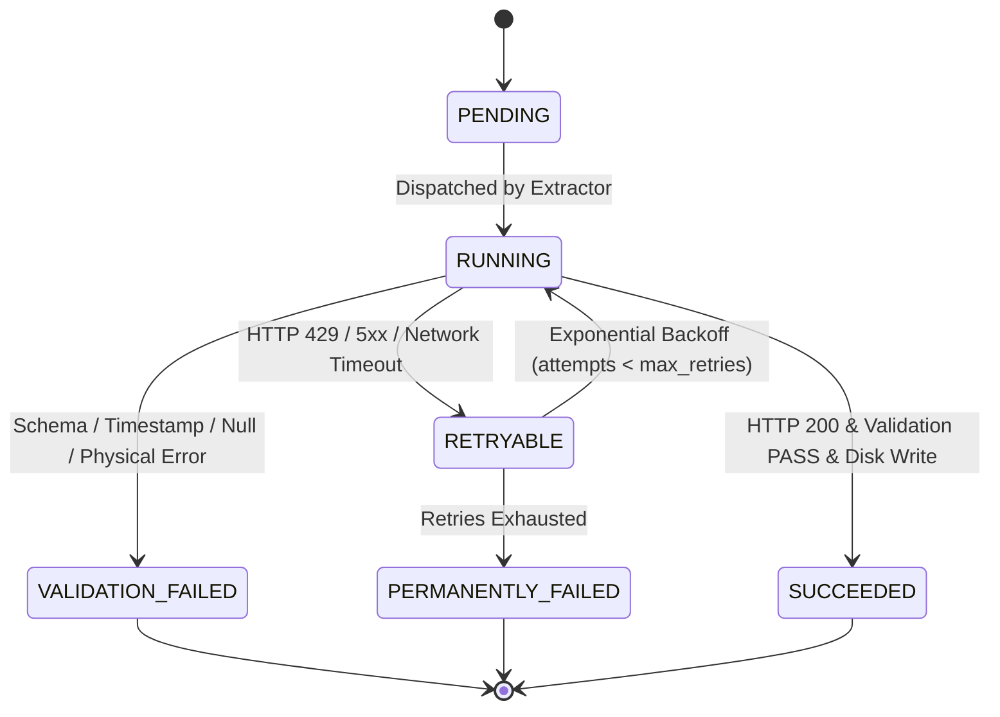

# Phase 3.9 — Historical Meteorological Extraction Engine

## 1. Overview and Scope

This document details the production-safe, reusable historical meteorological extraction engine implemented in **Phase 3.9** for Open-Meteo ECMWF ERA5 reanalysis data covering the State of Karnataka across the validated historical flood period (1969–1994).

> [!IMPORTANT]
> **Operational Status:**
> **Implementation is complete, but the 26-year historical extraction has not been executed.**
> Only a single controlled verification chunk (1994 batch 001, 10 cells) was executed to empirically test the pipeline machinery, raw data preservation, and manifest idempotency. No database records have been inserted, no migrations created, and no ML models trained.

---

## 2. Architecture and Modules

The extraction engine is located under `backend/app/ingestion/historical/`, completely segregated from operational short-term forecast ingestion:

```text
backend/app/ingestion/historical/
├── __init__.py      # Package public API exports
├── models.py        # Domain dataclasses, ChunkStatus, ExtractionConfig, ValidationResult
├── grid.py          # Authoritative Karnataka 324-cell 0.25° grid & chunk generator
├── client.py        # Dedicated HTTP client for Open-Meteo Historical Weather API
├── validator.py     # Deterministic validation against physical and structural invariants
├── manifest.py      # Persistent JSON checkpoint manager with hash-verified idempotency
├── extractor.py     # Core extraction orchestrator, raw file compressor, and provenance wrapper
└── cli.py           # Command-line interface with safety guards against accidental bulk extraction
```

### Module Responsibilities

| Module | Purpose | Key Responsibilities |
| :--- | :--- | :--- |
| **`models.py`** | Data Models | Defines `GridCell`, `ExtractionChunk`, `ExtractionMetadata`, `ValidationResult`, `ExtractionConfig`, and `ChunkStatus`. |
| **`grid.py`** | Spatial Partitioning | Contains the 324 Karnataka-intersecting 0.25° cells verified in Phase 3.7B Gate 3; partitions them into 33 batches (32 batches of 10 cells + 1 batch of 4 cells); generates deterministic chunks. |
| **`client.py`** | External API Client | Implements `HistoricalOpenMeteoClient` with explicit `models=era5`, `timezone=UTC`, `precipitation_unit=mm`, `temperature_unit=celsius`, retry backoff with jitter, and 60s cooldown on HTTP 429. |
| **`validator.py`** | Integrity Verification | Validates HTTP 200, coordinate snapping ($\pm 0.001^\circ$), expected hours (8,760 or 8,784), timestamp progression (+1h), duplicate detection, zero nulls, non-negative precipitation, and RH bounds ($[0, 100\%]$). |
| **`manifest.py`** | State & Checkpoint | Manages `extraction_manifest.json` with atomic writes; guarantees idempotency (never re-downloads a SUCCEEDED chunk with a matching disk checksum). |
| **`extractor.py`** | Orchestration | Coordinates client fetch, validation, gzip compression, SHA-256 calculation, raw filesystem storage, and manifest updates. |
| **`cli.py`** | Operational CLI | Provides guarded execution with `--year`, `--start-year`, `--end-year`, `--batch`, `--limit`, `--dry-run`, and `--resume`. Blocks accidental statewide 26-year extraction without explicit confirmation. |

---

## 3. Data Contract & Query Parameters

The client explicitly queries the Open-Meteo Historical Weather API without relying on provider defaults or fallback models:

- **Endpoint:** `https://archive-api.open-meteo.com/v1/archive`
- **Model:** `models=era5` (Explicitly requested; substitution of `era5_land`, `best_match`, or `ecmwf_ifs` is prohibited)
- **Timezone:** `timezone=UTC` (Mandatory; prevents calendar shift)
- **Units:**
  - `precipitation_unit=mm` (Hourly interval accumulation of preceding hour)
  - `temperature_unit=celsius` (Degrees Celsius at 2m above ground)
- **Variables:** `precipitation,temperature_2m,relative_humidity_2m,surface_pressure`

---

## 4. Deterministic Extraction Chunking

Extraction chunks are generated deterministically from spatial batches and calendar years:

- **Spatial Batches:** 33 batches (32 batches of 10 cells + 1 batch of 4 cells for 324 total cells).
- **Time Chunk:** 1 complete calendar year (`start_date=YYYY-01-01&end_date=YYYY-12-31`).
- **Chunk Identifier Format:** `era5_{year}_batch_{batch_id:03d}` (e.g. `era5_1994_batch_001`).
- **Total Planned Chunks (1969–1994):** $26\text{ years} \times 33\text{ batches} = \mathbf{858\text{ chunks}}$.

---

## 5. Raw Data Preservation & Checksums

### Directory Hierarchy
Raw environmental payloads are stored under `data/raw/era5_historical/` (which is ignored by Git via `.gitignore: data/raw/*`):

```text
data/raw/era5_historical/
├── extraction_manifest.json
└── year=1994/
    ├── batch_001.json.gz     # Exact raw API response compressed with gzip
    └── batch_001.meta.json   # Companion metadata wrapper with full provenance
```

### Checksum Hierarchy
1. **Uncompressed Payload SHA-256 (`payload_sha256`):** Computed directly on the raw bytes received from the HTTP response body before any decoding or pretty-printing.
2. **Compressed File SHA-256 (`compressed_sha256`):** Computed directly on the `.json.gz` file written to disk. **This checksum is authoritative for file identity and disk integrity.**

---

## 6. Manifest State Machine & Idempotency

The persistent manifest tracks the complete lifecycle of every chunk:



### Idempotency Guarantee
When `extract_chunk(chunk)` is invoked, it checks `manifest.is_chunk_completed(chunk_id)`:
1. Manifest status must equal `SUCCEEDED`.
2. Raw file `data/raw/era5_historical/year=YYYY/batch_BBB.json.gz` must exist on disk and be non-empty.
3. The SHA-256 checksum of the file on disk must match `compressed_sha256` recorded in the manifest.

If all three conditions are met, the network request is skipped immediately. If any check fails (e.g. file missing or corrupted), the chunk is not treated as completed.

---

## 7. Validation Rules

Every chunk response must pass ten automated integrity checks:
1. **HTTP Status:** Must equal `200`.
2. **Location Count:** Number of returned location objects must equal the number of requested cells.
3. **Coordinate Snapping:** Returned coordinates must match requested cell coordinates within $\pm 0.001^\circ$.
4. **Hourly Count:** Must equal 8,760 hours for non-leap years, or 8,784 hours for leap years (calculated via `calendar.isleap(year)`).
5. **Timestamp Bounds:** First timestamp must be `YYYY-01-01T00:00`; last timestamp must be `YYYY-12-31T23:00`.
6. **Chronological Progression:** Strict $+1\text{h}$ progression with zero missing timestamps.
7. **No Duplicates:** `len(set(times)) == len(times)`.
8. **Zero Nulls:** Zero nulls across all 4 required variables (`precipitation`, `temperature_2m`, `relative_humidity_2m`, `surface_pressure`).
9. **Physical Constraints:** Precipitation $\ge 0.0\text{ mm}$, Relative Humidity $\in [0.0, 100.0]\%$, finite floats (no `NaN`, `Inf`).
10. **Zero Silent Repair:** Invalid data triggers `VALIDATION_FAILED`; no synthetic filling or interpolation.

---

## 8. CLI Usage & Safety Controls

The command-line interface (`python -m app.ingestion.historical.cli`) provides controlled extraction:

```bash
# Extract a single chunk (1994 batch 1)
PYTHONPATH=backend backend/.venv/bin/python -m app.ingestion.historical.cli --year 1994 --batch 1 --limit 1

# Dry run across all batches of 1994 (no disk writes)
PYTHONPATH=backend backend/.venv/bin/python -m app.ingestion.historical.cli --year 1994 --dry-run

# Resume any incomplete chunks for 1994
PYTHONPATH=backend backend/.venv/bin/python -m app.ingestion.historical.cli --year 1994 --resume
```

### Safety Guards
1. **Explicit Scope Required:** The CLI rejects execution without an explicit `--year`, `--start-year`/`--end-year`, or `--resume` flag.
2. **Bulk Extraction Guard:** Targeting the complete 26-year range (1969–1994) without `--limit` or `--dry-run` is blocked unless `--force-full-range` is explicitly provided.

---

## 9. Controlled Real API Test (1 Chunk)

A single real chunk was extracted to empirically verify the engine:

- **Target Chunk:** `era5_1994_batch_001` (10 validated cells, calendar year 1994).
- **HTTP Status:** `200 OK`.
- **Response Latency:** `2.834 seconds`.
- **Uncompressed Payload Size:** `3,339,997 bytes` (~3.34 MB).
- **Compressed File Size:** `539,849 bytes` (~540 KB gzipped, 6.19x ratio).
- **Payload SHA-256:** `b6aaa5d92b6572a3b22ee14e0292df056f1a6348192d2da6a55a36a0927de4f9`.
- **Compressed SHA-256:** `e41266e8792188bc806e94df4c4423c2fa89acbabee351897077bca3399ad4be`.
- **Validation Outcome:** All 10 locations matched coordinates ($\pm 0.0001^\circ$), exactly 8,760 hours per location (87,600 total records), 0 duplicate timestamps, 0 missing timestamps, 0 null values across all 4 variables.
- **Manifest State:** Transitioned `PENDING` $\to$ `RUNNING` $\to$ `SUCCEEDED`.
- **Second-Run Idempotency Test:** Executing the identical command immediately skipped the chunk (`Skipped (Cached): 1`), with zero network calls made.
- **Database Safety:** Table row counts before and after were identical (`weather_observations`: 397, `rainfall_observations`: 397, `districts`: 31, `taluks`: 240). Zero database mutations.

---

## 10. Limitations & Next Steps

1. **Extraction Scope:** Only 1 of the planned 858 chunks has been extracted. The remaining 857 chunks remain to be extracted in future controlled execution phases.
2. **Database Staging:** Historical data currently resides exclusively as compressed raw JSON in `data/raw/era5_historical/`. Ingestion into relational tables (`historical_weather_daily`) or columnar Parquet stores is deferred to subsequent phases.
3. **Pacing and Monitoring:** Sequential execution of all 858 chunks will require monitoring for provider throttling or transient network timeouts during multi-hour runs.

---

## 11. Unresolved Issues

Operational limitations remain intentionally untested at full scale. The 858-chunk extraction has not been executed, so provider throttling behavior, long-running failure recovery, and production-scale throughput remain to be monitored during controlled expansion.
