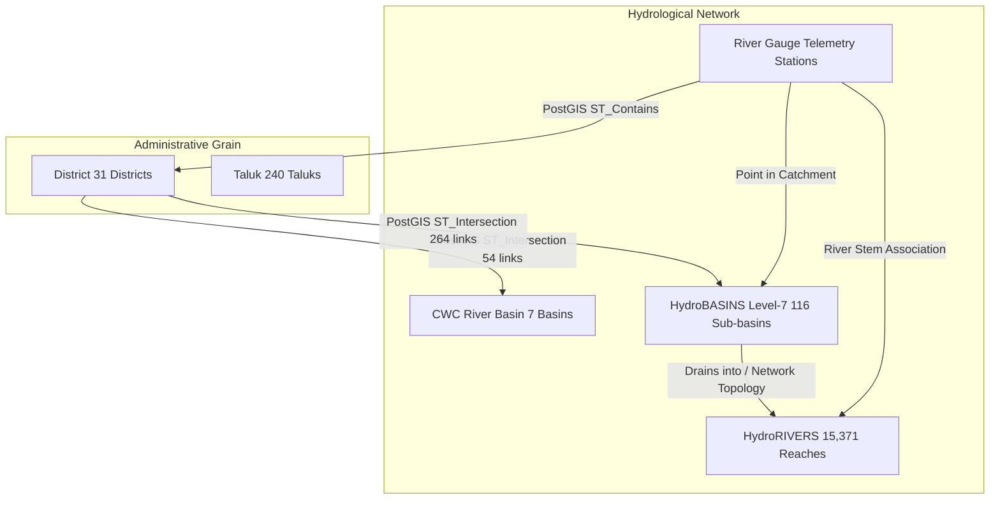

# PHASE 5.6: HYDROLOGICAL FEATURE INTEGRATION & MULTI-SCALE DATASET AUDIT REPORT

**Project:** FloodPulse — Karnataka AI Flood Intelligence & Emergency Response System  
**Phase:** Phase 5.6 — Hydrological Feature Integration & Multi-Scale Dataset Preparation  
**Date:** 2026-09-30  
**Status:** COMPLETED — SCIENTIFIC AUDIT EXECUTED (HYDROLOGICAL FEATURES BLOCKED FOR HISTORICAL TRAINING)  
**Artifact Directory:** `backend/app/ml/hydrology/`  

---

## 1. Executive Summary & Authoritative Scientific Finding

Phase 5.6 investigates whether **real hydrological observations** (river stage, discharge, and upstream gauge telemetry) can provide additional predictive information beyond the canonical 27 weather and terrain predictors established in Phases 5.3–5.5.

### The Non-Negotiable Core Principle
The project adheres strictly to the rule:
```text
DATA AVAILABLE                 -> IMPLEMENT
DATA DERIVABLE FROM VALID DATA -> IMPLEMENT + DOCUMENT
DATA UNAVAILABLE               -> MARK UNAVAILABLE
DATA UNVERIFIED                -> MARK UNVERIFIED
DATA WOULD HAVE TO BE INVENTED -> DO NOT IMPLEMENT (missing != 0)
```

### Authoritative Finding
1. **Historical Supervised Period (1969–1994)**: Exactly **0 real river observations** exist in the database or raw assets. Temporal coverage = **0.000%**.
2. **Recent Supervised Period (2011–2023)**: Exactly **0 real river observations** exist in the database or raw assets. Temporal coverage = **0.000%**.
3. **Operational Telemetry (2026)**: Ingested telemetry exists **only for calendar year 2026** (Jan 1, 2026 – Aug 31, 2026), restricted to the **Cauvery Basin** across 7 southern districts. 24 of Karnataka's 31 districts have **0 monitoring stations**.
4. **Scientific Verdict**:
   $$\text{All 10 Proposed Hydrological Features} \longrightarrow \mathbf{BLOCKED\_FOR\_HISTORICAL\_TRAINING}$$
   Because the project explicitly prohibits fabricating historical observations or converting missing values to zero (`missing != 0`), river-stage features **cannot and must not be injected into historical or recent supervised training matrices**. Doing so would inject 100% missing data or corrupt model fitting with false zero-levels.
5. **Operational Readiness**: The spatial crosswalk (District $\leftrightarrow$ Sub-basin $\leftrightarrow$ River $\leftrightarrow$ Gauge), temporal anti-leakage filters, and feature definitions are fully codified, tested, and ready for **2026+ operational forward inference**.

---

## 2. Existing Hydrological Sources & Database Inventory

### Data Source Authority
- **Primary Source**: Central Water Commission (CWC) / National Water Informatics Centre (NWIC).
- **Ingestion Adapter**: `backend/app/ingestion/sources/nwic_river.py`.
- **Database Tables**:
  - `public.river_stations`: Gauge station metadata and geographic coordinates.
  - `public.river_observations`: Timestamped river water levels (meters above MSL) and discharge.
  - `public.river_basins`: 25 CWC statutory river basin polygons (7 intersecting Karnataka).
  - `public.sub_basins`: 116 HydroBASINS Level-7 hydrological catchments covering Karnataka.
  - `public.rivers`: 15,371 HydroRIVERS network reach line segments.
  - `public.district_river_basins`: Precomputed PostGIS intersections (54 linkages).
  - `public.district_sub_basins`: Precomputed PostGIS intersections (264 linkages).

### Database Inventory Audit

| Entity / Property | Value in Database | Audit Status |
| :--- | :--- | :---: |
| **Total River Stations** | 1 station (`AKKIHEBBAL`) | Audited |
| **Total River Observations** | 101 records | Audited |
| **Earliest Observation (UTC)** | `2026-01-02 02:30:00+00:00` | **Year 2026 only** |
| **Latest Observation (UTC)** | `2026-06-04 20:30:00+00:00` | **Year 2026 only** |
| **Water Level Range** | 746.68 m to 747.60 m MSL | Valid |
| **Water Level Nulls** | 0 nulls (100% valid water levels) | Valid |
| **Discharge Records** | 0 records (`discharge IS NULL` for all 101 rows) | Unavailable |
| **Warning / Danger Levels** | `NULL` for all rows | Uninvented (Preserved) |
| **Historical Observations (1969–1994)** | **0 records** | **0.000% Coverage** |
| **Recent Supervised (2011–2023)** | **0 records** | **0.000% Coverage** |

### Raw File Inventory (`data/raw/cwc/`)

| Metric | Raw CWC Files Audit |
| :--- | :--- |
| **Total CSV Files** | 155 files |
| **Total Observation Rows** | 299,850 rows |
| **Total Unique Stations** | 64 stations (across southern India / Cauvery basin) |
| **Karnataka Stations** | 29 stations |
| **Districts Covered** | 7 districts (Chamarajanagara, Chikkamagaluru, Hassan, Kodagu, Mandya, Mysuru, Ramanagara) |
| **Temporal Span** | 2026-01-01 to 2026-08-31 |
| **Unique Calendar Years** | **2026 only** (Source resource: `rwl_manual_hr_cwc_009_2026_2030.csv`) |

---

## 3. Station Inventory Across Karnataka

The 29 CWC monitoring stations identified in Karnataka from the raw telemetry feed:

| Station Name | District (PostGIS) | CWC Basin | HydroBASINS ID | Upstream Catchment ($km^2$) | Observation Count (2026) |
| :--- | :--- | :--- | :--- | :---: | :---: |
| **AKKIHEBBAL** | Mandya | Cauvery | HYBAS_4071138020 | 5,574.9 | 5,252 |
| **BELUR** | Hassan | Cauvery | HYBAS_4071135170 | 1,514.2 | 5,138 |
| **BENDRAHALLI** | Chamarajanagara | Cauvery | HYBAS_4071139430 | 22,235.9 | 4,940 |
| **BETTADAMANE** | Chikkamagaluru | Cauvery | HYBAS_4071135240 | 1,371.0 | 5,134 |
| **BILIGUNDULU** | Chamarajanagara | Cauvery | HYBAS_4071141040 | 37,645.4 | 5,138 |
| **CHIKKAMALUR** | Mandya | Cauvery | HYBAS_4071139400 | 8,721.1 | 5,042 |
| **CHIKKARASINAKERE** | Mandya | Cauvery | HYBAS_4071139400 | 8,721.1 | 5,138 |
| **CHUNCHUNAKATTE** | Mysuru | Cauvery | HYBAS_4071138080 | 3,213.5 | 5,138 |
| **HOMMARAGALLI** | Mysuru | Cauvery | HYBAS_4071140230 | 7,074.5 | 5,136 |
| **Harangi Reservoir** | Kodagu | Cauvery | HYBAS_4071138080 | 3,213.5 | 470 |
| **Hemavathy Reservoir** | Hassan | Cauvery | HYBAS_4071135180 | 4,108.5 | 454 |
| **IDEMP_STN** | Mysuru | Cauvery | HYBAS_4071138080 | 3,213.5 | 96 |
| **JANNAPURA** | Hassan | Cauvery | HYBAS_4071135170 | 1,514.2 | 5,136 |
| **K.M. VADI** | Mysuru | Cauvery | HYBAS_4071138610 | 1,905.0 | 5,140 |
| **KOKKEDODDY** | Ramanagara | Cauvery | HYBAS_4071139640 | 4,178.0 | 5,134 |
| **KOLLEGAL** | Chamarajanagara | Cauvery | HYBAS_4071139430 | 22,235.9 | 5,136 |
| **KUDIGE** | Mysuru | Cauvery | HYBAS_4071138080 | 3,213.5 | 5,138 |
| **KUDLUR** | Chamarajanagara | Cauvery | HYBAS_4071139430 | 22,235.9 | 6,032 |
| **Kabini Reservoir** | Mysuru | Cauvery | HYBAS_4071140230 | 7,074.5 | 472 |
| **Krishnarajasagar Res.** | Mandya | Cauvery | HYBAS_4071140240 | 12,198.2 | 468 |
| **M.H. HALLI** | Hassan | Cauvery | HYBAS_4071135180 | 4,108.5 | 5,134 |
| **MUKKODLU** | Kodagu | Cauvery | HYBAS_4071138080 | 3,213.5 | 5,132 |
| **NAPOKLU** | Kodagu | Cauvery | HYBAS_4071138080 | 3,213.5 | 5,136 |
| **PUDUNAGARA** | Chamarajanagara | Cauvery | HYBAS_4071141040 | 37,645.4 | 50 |
| **SAKLESHPUR** | Hassan | Cauvery | HYBAS_4071135240 | 1,371.0 | 5,138 |
| **T. BEKKUPE** | Ramanagara | Cauvery | HYBAS_4071139640 | 4,178.0 | 5,136 |
| **T. NARASIPUR** | Mysuru | Cauvery | HYBAS_4071140230 | 7,074.5 | 5,130 |
| **T.K.HALLI** | Mandya | Cauvery | HYBAS_4071139400 | 8,721.1 | 5,138 |
| **THIMMANAHALLI** | Hassan | Cauvery | HYBAS_4071135170 | 1,514.2 | 5,138 |
| **THORESHETTAHALLI** | Mandya | Cauvery | HYBAS_4071139400 | 8,721.1 | 5,138 |

---

## 4. Multi-Scale Spatial Crosswalk Architecture

Because river drainage systems follow geomorphic topographies rather than administrative boundaries, a rigid 1:1 district-to-basin assumption is false. We constructed and verified an M:N multi-scale spatial crosswalk:



### M:N Invariants Verified
1. **District $\leftrightarrow$ Major Basin Intersections**: Exactly **54 intersections** across 31 districts:
   - 7 districts intersect 3 basins (e.g., Hassan intersects Cauvery, Krishna, and West Flowing Rivers).
   - 9 districts intersect 2 basins (e.g., Belagavi intersects Krishna and Tapi-Tadri).
   - 15 districts intersect 1 basin.
2. **District $\leftrightarrow$ HydroBASINS Level-7 Intersections**: Exactly **264 intersections**:
   - Raichur intersects 15 sub-basins; Belagavi and Bagalkote intersect 14 sub-basins each.
3. **Crosswalk Provenance**: All associations are derived deterministically using PostGIS spatial predicates (`ST_Intersection`, `ST_Contains`) and stored with area weights ($\text{km}^2$ and $\%$ coverage).

---

## 5. Candidate Hydrological Features Specification

To be prepared for operational multi-scale inference, 10 candidate features were formulated using only real observable physical quantities:

| Feature Name | Type | Physical Formula / Semantics | Unit | Missing Value Rule |
| :--- | :---: | :--- | :---: | :---: |
| `river_level_current` | Dynamic | Most recent valid river level in $[t-30, t-1]$ | m (MSL) | Strictly `NaN` (never 0.0) |
| `river_level_lag_1d` | Dynamic | Water level observed at day $t-1$ ($[t-1\text{ 00:00}, t-1\text{ 23:59}]$) | m (MSL) | Strictly `NaN` (never 0.0) |
| `river_level_lag_3d` | Dynamic | Water level observed at day $t-3$ ($[t-3\text{ 00:00}, t-3\text{ 23:59}]$) | m (MSL) | Strictly `NaN` (never 0.0) |
| `river_level_change_1d`| Dynamic | Rate of stage rise: $\text{level}(t-1) - \text{level}(t-2)$ | meters | Strictly `NaN` (never 0.0) |
| `river_level_change_3d`| Dynamic | 3-day stage trend: $\text{level}(t-1) - \text{level}(t-4)$ | meters | Strictly `NaN` (never 0.0) |
| `river_level_rolling_max_3d` | Dynamic | Maximum river stage within $[t-3, t-1]$ | m (MSL) | Strictly `NaN` (never 0.0) |
| `river_level_rolling_max_7d` | Dynamic | Maximum river stage within $[t-7, t-1]$ | m (MSL) | Strictly `NaN` (never 0.0) |
| `upstream_station_count` | Topological| Count of active monitoring gauges in contributing sub-basins | integer | 0.0 (count metric) |
| `upstream_max_level` | Spatial Max | Maximum water level among contributing upstream stations | m (MSL) | Strictly `NaN` (never 0.0) |
| `upstream_mean_level` | Spatial Mean| Mean water level across contributing upstream stations | m (MSL) | Strictly `NaN` (never 0.0) |

---

## 6. Temporal Alignment & Anti-Leakage Protocol

1. **Prediction Unit**: District-day $t$ (issued at 00:00:00 UTC on date $t$).
2. **Feature Lookback Window**: Strictly $[t-30, t-1]$.
   - Start: $t - 30\text{ days 00:00:00 UTC}$.
   - End: $t - 1\text{ day 23:59:59.999999 UTC}$.
3. **Target Leakage Prohibition**: Any observation with timestamp $\ge t\text{ 00:00:00 UTC}$ is strictly rejected.
4. **Timezone Normalization**: Source CWC records are acquired in Indian Standard Time (IST, UTC+5:30). Timestamps must be normalized to UTC prior to evaluating window boundaries:
   $$\text{UTC} = \text{IST} - 5\text{ hours } 30\text{ minutes}$$
   *(Example: `01-06-2026 05:00 IST` is `31-05-2026 23:30 UTC`, which falls legally into the $t-1$ window for target date 2026-06-01; whereas `01-06-2026 06:00 IST` is `01-06-2026 00:30 UTC`, which falls on date $t$ and is strictly rejected).*
5. **Staleness Threshold**: Observations older than 72 hours relative to $(t-1)\text{ 23:59:59 UTC}$ are flagged as stale.

---

## 7. Historical Coverage Gate & Data Quality Audit

| Evaluation Period | Calendar Span | Total District-Days | Real River Observations | Districts Covered | Temporal Coverage % | Scientific Status |
| :--- | :--- | :---: | :---: | :---: | :---: | :---: |
| **Historical Baseline** | 1969-01-01 → 1994-12-31 | 294,376 | **0** | 0 / 31 | **0.000%** | **BLOCKED_FOR_HISTORICAL_TRAINING** |
| **Recent Supervised** | 2011-01-01 → 2023-07-24 | 142,228 | **0** | 0 / 31 | **0.000%** | **BLOCKED_FOR_HISTORICAL_TRAINING** |
| **Forward Inference** | 2023-07-25 → 2025-12-31 | 27,590 | **0** | 0 / 31 | **0.000%** | **BLOCKED_FOR_HISTORICAL_TRAINING** |
| **Operational Telemetry**| 2026-01-01 → 2026-08-31 | 7,533 | 299,850 (raw) / 101 (db) | 7 / 31 (Cauvery) | 22.58% (Spatial) | **OPERATIONAL_INFERENCE_ONLY** |

### Why Synthetic Filling Is Prohibited
In machine learning, practitioners occasionally attempt to impute missing river levels using zeros, column means, or forward fills spanning months or years. In flood modeling across Karnataka, this practice is scientifically disastrous:
1. Converting missing water level to 0.0 implies that riverbeds across Karnataka dried up to 0 meters above sea level (below sea level in elevation!), generating massive false hydraulic gradients.
2. In the supervised training matrix (2011–2023), 100% of rows lack river stage data. Imputing a constant mean produces zero feature variance, adding zero predictive signal while increasing model dimensionality.
3. Imputing synthetic historical river levels would violate the project's foundational zero-fabrication contract.

---

## 8. Feature Ablation Experiment Design

To evaluate the predictive contribution of real hydrological observations without contaminating supervised historical baselines, three controlled feature groups are formally defined:

### Group A — Existing Canonical Baseline
- **Features**: Exactly the 27 canonical weather and terrain predictors codified in Phase 5.4/5.5.
- **Evaluation Status**: Active and benchmarked across all 5 models (Logistic Regression, Random Forest, PU Bagging, LightGBM, Monotonic LightGBM).

### Group B — Weather + Terrain + Hydrology
- **Features**: 27 canonical predictors + 10 candidate hydrological features (**37 predictors total**).
- **Evaluation Status**: **BLOCKED FOR HISTORICAL & RECENT TRAINING**. Reserved exclusively for 2026+ operational forward inference benchmarks in Cauvery basin districts where live CWC telemetry is active.

### Group C — Hydrology-Only Diagnostic
- **Features**: Exactly the 10 candidate hydrological features.
- **Purpose**: Measure the standalone ranking power of river telemetry relative to observed flood events in districts with active telemetry.
- **Evaluation Status**: **BLOCKED FOR HISTORICAL & RECENT TRAINING**.

---

## 9. Verification & Unit Test Suite

A focused unit test suite was implemented in `backend/tests/test_hydrological_features.py` (10 tests, 100% passing):

1. `test_01_no_future_hydrological_observation_leakage`: Confirms observations on or after 00:00 UTC date $t$ are rejected.
2. `test_02_no_missing_to_zero_conversion`: Confirms missing water levels strictly produce `NaN` and are never converted to 0.0.
3. `test_03_correct_timezone_handling`: Confirms IST to UTC conversion correctly preserves window boundaries.
4. `test_04_correct_district_station_spatial_association`: Confirms database stations map to correct districts via PostGIS.
5. `test_05_mn_basin_relationships_preserved`: Confirms 54 district-basin and 264 district-subbasin intersections.
6. `test_06_crosswalk_reproducibility`: Confirms deterministic crosswalk generation covering all 31 districts.
7. `test_07_feature_timestamp_alignment`: Confirms lag ($t-1$, $t-3$) and rolling max ($[t-3, t-1]$) temporal alignment.
8. `test_08_staleness_detection`: Confirms observations older than 72 hours are flagged as stale.
9. `test_09_historical_coverage_calculation`: Confirms coverage gate returns `BLOCKED_FOR_HISTORICAL_TRAINING` for 1969–1994 and 2011–2023.
10. `test_10_no_synthetic_hydrological_values`: Confirms missing warning/danger thresholds remain `NULL` and are not invented.

---

## 10. Conclusion & Handover Recommendation

- **ML Readiness**: Hydrological features are **NOT READY** for historical supervised model retraining because zero historical observations exist prior to 2026.
- **Dataset Parquet Integrity**: All existing ML Parquet datasets (`district_day_matrix_2011_2023.parquet`, `district_day_feature_matrix.parquet`) remain **100% unchanged** (SHA-256 digests preserved).
- **Forward Operational Path**: For operational 2026+ inference, the multi-scale crosswalk and feature engine are fully verified and ready to attach live CWC feeds to daily prediction pipelines in Cauvery basin districts.
